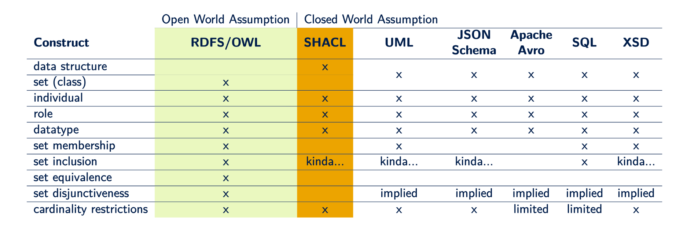

# cim-shacl-profile

This repository represents the specification of the parts of SHACL that the CIM community uses for its standardisation purposes. SHACL is an expansive language that has some quite powerful data validation constructs, however some of those are unique to data that is represented in a graph structure. Since the CIM intends to be serialization agnostic, this means we have to consider whether the data specifications we produce can in fact be translated to most data formats. For this purpose we aim to constrain the use of SHACL to ensure translateability to other formats. The table shown below gives a rough overview of the expressiveness of different data validation languages.

## selecting common expressiveness
Based on the diagram above, the most common modelling constructs are:

- data structures 
- individuals
- roles (attributes/relationships)
- datatypes
- cardinality restrictions

## Advanced needs for grid data validation

One of the challenges that grid data presents to the users of the grid is that plain data validation (syntax, structure, see the list above) is often insufficient. When performing a powerflow calculation or state estimation there are high demands on the consistency between multiple attributes across multiple classes.  

